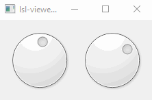
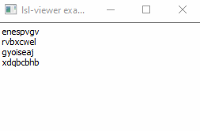

# Overview

StreamViewer comes with several example applications, all of which use LSL streams. Three of the examples are feature-complete applications for turnkey use. The remaining applications are intended to be simple and instructive.

Each of the examples can be launched at the terminal with `python -m stream_viewer.examples.{example name}`.

## Featured Applications

The featured applications are `main`, `stream_status_qml`, and `lsl_custom`. They each have an entry point, meaning they can be run from the command-line without entering a Python console. These commands are `lsl_viewer`, `lsl_status`, and `lsl_viewer_custom`, respectively. Please refer to their respective pages in the documentation.:

* [lsl_viewer](lsl_viewer.md)
* [lsl_status](lsl_status.md)
* [lsl_viewer_custom](lsl_viewer_custom.md)

## Instructive Examples

### `minimal_signals`

This example generates a pair of sinusoids, creates a renderer with a widget containing dials, then connects the signal generator output to the dials' values. 

### `minimal_markers`

This example generates random strings, a renderer containing a text edit widget, then connects the string generator output to text insertion.

### `lsl_linevis`

This example application makes use of the stream_viewer modules. It uses the `StreamLSLData` data module and the `LineVis` renderer module. To keep it simple, the connected stream name is hard coded to type='EEG' but this can easily be changed in its initializer.

